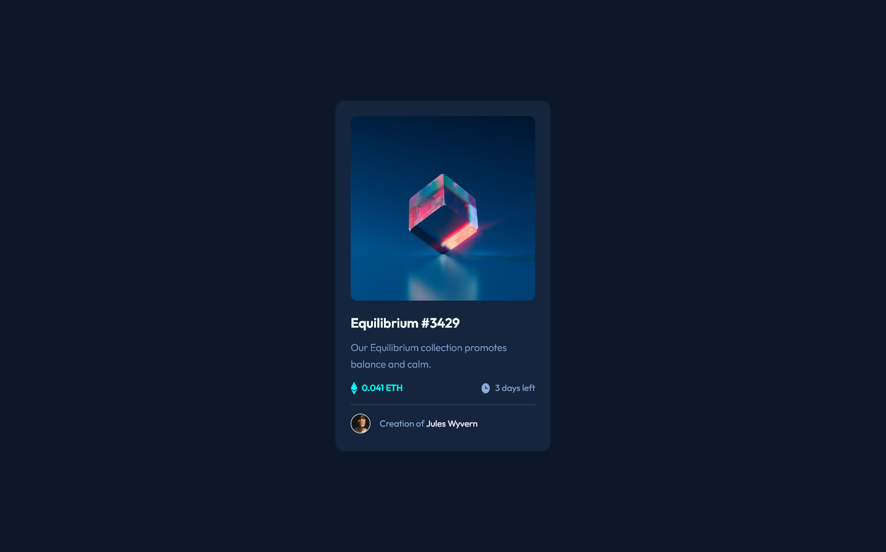
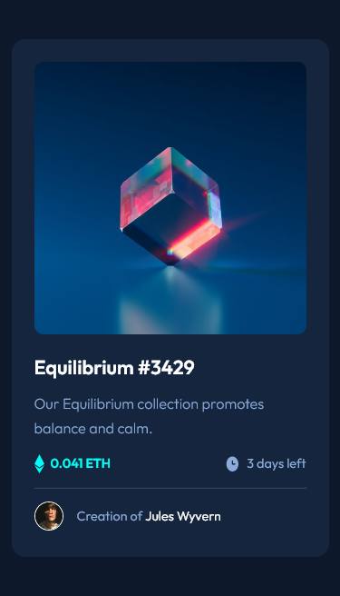

# Frontend Mentor - NFT preview card component solution

This is a solution to the [NFT preview card component challenge on Frontend Mentor](https://www.frontendmentor.io/challenges/nft-preview-card-component-SbdUL_w0U). Frontend Mentor challenges help you improve your coding skills by building realistic projects. 

## Table of contents

- [Overview](#overview)
  - [The challenge](#the-challenge)
  - [Screenshot](#screenshot)
  - [Links](#links)
- [My process](#my-process)
  - [Built with](#built-with)
  - [What I learned](#what-i-learned)
  - [Useful resources](#useful-resources)
- [Author](#author)

## Overview

### The challenge

Users should be able to:

- View the optimal layout depending on their device's screen size
- See hover states for interactive elements

### Screenshot

### Links

- Solution URL: [nft card preview](https://nft-card-preview-shiiron.netlify.app/)

## My process

### Built with

- Angular
- Netlify (for hosting)

### What I learned

- Creating a new basic Angular project (that i will use for other frontend mentor challenge)
- Setting up and deploying my solution on Netlify
- Creating overlay for images

Easy and simple project but a very good way to get me into frontend mentor projects. I do think the result is not yet perfect and i could implement a lot of things. I sure will look for that in my next try !

### Useful resources

- [resource 1](https://www.w3schools.com/howto/howto_css_image_overlay.asp) - This example helped me creating the image overlay

## Author
- Frontend Mentor - [@Shiiron](https://www.frontendmentor.io/profile/Shiiron)
